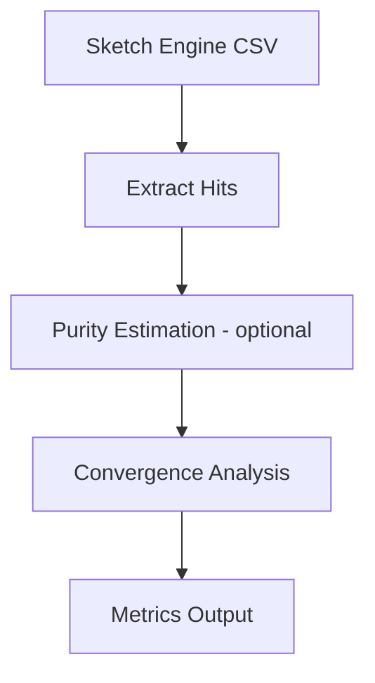

# Terminology Convergence Analyser

This repository implements the lexicometric methodology developed in my MSc dissertation at the University of Edinburgh.

It provides a lightweight, reproducible pipeline for analysing **terminology convergence** across competing variant forms using corpus-derived frequency data.

The tool is designed for linguistic and language technology research, where a single concept (for example, *hashtag*) may appear in multiple competing variants (such as Arabic forms like `وسم`, `هاشتاغ`, and `علامة التصنيف`).

Rather than relying on impressionistic interpretation, the pipeline supports a **data-driven analysis** of:

- variant frequency
- dominance patterns
- convergence strength across competing forms

## Theoretical Background

This project adopts a simple lexicometric approach to terminology convergence.

Let:

- \( f_i \) denote the observed frequency of variant \( i \)
- \( p_i \) denote the semantic purity of variant \( i \), when ambiguity is present

For ambiguous variants, the pipeline estimates an adjusted frequency:
```
effective_hits_i = f_i × p_i
```
For non-ambiguous variants, the raw frequency is used directly.

The degree of convergence is then captured through the **dominance ratio**, defined as the share of the most frequent variant among all competing forms:
```
D = max(effective_hits_i / Σ effective_hits_i)
```
A higher dominance ratio indicates stronger convergence toward a single preferred variant.

## Method Overview

The pipeline follows a simple but extensible workflow:

1. Define a concept and its candidate variants  
2. Export concordance data for each variant from Sketch Engine  
3. Extract total hit counts from concordance metadata  
4. (Optional) Estimate semantic purity for ambiguous variants  
5. Compute effective frequencies and convergence metrics  
6. Output structured results for analysis or visualisation

## Workflow



### Semantic Purity Adjustment (Optional)

Some variants may be **semantically ambiguous**.

For example, the Arabic term *وسم* can mean:
- hashtag (target meaning)
- label / marking (non-target meaning)

To address this, the pipeline includes an optional **sampling-based purity estimation step**:

- A small concordance sample is manually annotated  
- The proportion of target meaning is estimated as *p*  
- The total frequency is adjusted as:
```
effective_hits = total_hits × p
```
This allows the model to account for semantic noise without requiring full-scale disambiguation.

For variants without ambiguity, raw hit counts are used directly.

## Repository Structure
```
config/
  terms.yml              # concept and variant definitions
  rules.yml              # (legacy / optional)

data/
  raw/                   # Sketch Engine exports (one file per variant)
  processed/             # extracted frequencies and computed metrics
  sample/                # manually labelled samples for purity estimation
  output_example/        # example outputs (optional)

notebooks/
  01_extract_hits.ipynb
  02_convergence_analysis.ipynb
  op_purity_estimation.ipynb

README.md
```

## How to Use

1. Place Sketch Engine concordance exports in:
```
data/raw/
```
2. Run:
```
notebooks/01_extract_hits.ipynb
```
3. (Optional) If a variant is ambiguous:
```
notebooks/op_purity_estimation.ipynb
```
4. Run:
```
notebooks/02_convergence_analysis.ipynb
```
Outputs will be saved in:
```
data/processed/
```

## Example

The repository includes an example analysis for the concept *hashtag*, comparing variants such as:

- وسم
- هاشتاغ
- علامة التصنيف

The results illustrate how usage is distributed and whether convergence occurs.

## Project Scope

This repository is intended as a **methodological tool**, not a fixed dataset.

It can be applied to:
- any concept with competing variants
- any language supported by corpus tools such as Sketch Engine

The included examples serve only as demonstrations of the workflow.

## What does this project does

Given:
- a concept (e.g., "Hashtag")
- a list of candidate variants (surface forms)
- (optional) concordance samples exported a corpus tool

The workflow produces:
- frequency table for each variant
- dominance ratio (share of the most frequent variant)
- a convergence label (strong / medium / weak)
- simple visualisations (variant distribution)

## Future Work

- Integration with APIs for automated data collection
- Modularisation of notebook logic into reusable functions
- Improved visualisation of convergence patterns
